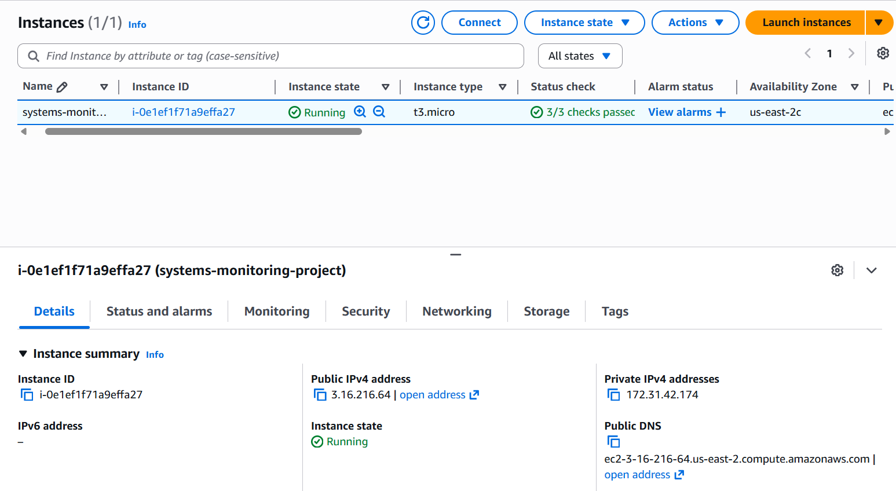
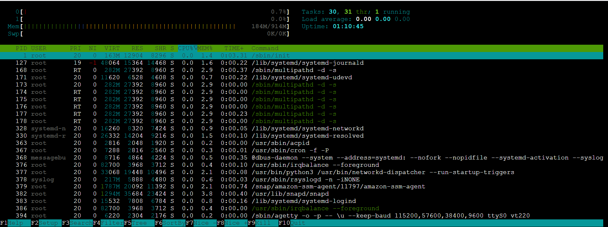
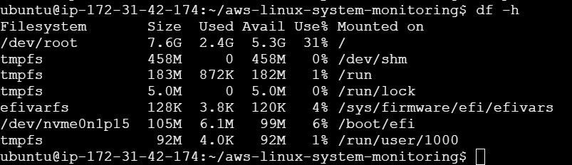
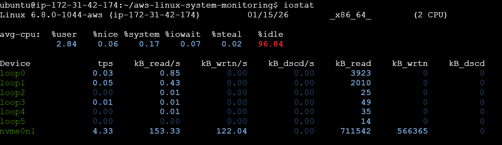
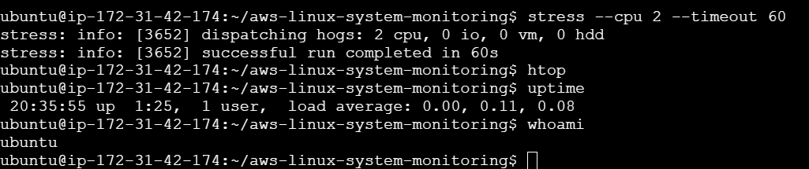

# AWS Linux System Monitoring & Load Testing

## Overview
This project demonstrates real-world Systems Engineering skills by deploying, monitoring, and stress-testing a Linux system on AWS EC2. The objective was to validate system health, resource utilization, and system behavior under CPU load using standard Linux monitoring and performance tools.

---

## Architecture
- Cloud Provider: Amazon Web Services (AWS)
- Service: EC2
- Instance Type: t3.micro (2 vCPU, 1 GB RAM)
- Operating System: Ubuntu 22.04 LTS
- Region: us-east-2

---

## Tools & Technologies
- Linux (Ubuntu 22.04)
- AWS EC2
- htop
- sysstat (iostat)
- vnstat
- stress
- systemd

---

## Project Implementation

### 1. EC2 Provisioning
- Launched an Ubuntu 22.04 EC2 instance
- Configured security groups for SSH access
- Connected using EC2 Instance Connect

---

### 2. System Updates & Stability
- Applied system updates and kernel upgrades
- Resolved package configuration and service restart issues
- Verified system stability after reboot

Commands used:
sudo apt update && sudo apt upgrade -y  
sudo reboot

---

### 3. Monitoring Setup
Installed system monitoring and performance tools:
sudo apt install -y htop sysstat vnstat stress

Enabled system statistics collection:
sudo systemctl enable sysstat  
sudo systemctl start sysstat

---

### 4. Resource Monitoring

CPU & Memory:
- Used htop to monitor real-time CPU and memory utilization
- Verified CPU idle above 98% during normal operation

Disk Usage:
df -h  
- Root filesystem utilization maintained below 35%

Disk I/O:
iostat  
- Verified low I/O wait (<1%)
- Confirmed no disk bottlenecks

---

### 5. CPU Load Testing
Simulated production CPU load using stress testing:
stress --cpu 2 --timeout 60

Observed behavior:
- CPU utilization reached 100% across both vCPUs
- Load average increased appropriately for a 2-core system
- System remained stable and recovered automatically after load completion

---

## Commands Used

The following Linux commands were executed on an AWS EC2 (Ubuntu 22.04) instance
to monitor system performance and validate stability under load.

```bash
sudo apt update
sudo apt install htop sysstat stress -y

# Real-time CPU & memory monitoring
htop

# Disk I/O statistics
iostat

# Disk usage
df -h

# CPU stress testing
stress --cpu 2 --timeout 60

---

## Results
- CPU idle maintained above 98% during normal operation
- Disk utilization remained under 35%
- I/O wait remained below 1%
- System demonstrated stable behavior under full CPU load

---

## Key Learnings
- Linux system performance monitoring
- CPU load vs core count analysis
- Disk utilization and I/O analysis
- Safe load testing in cloud environments
- Real-time troubleshooting and validation

---

## Conclusion
This project demonstrates hands-on Systems Engineering skills, including cloud infrastructure management, Linux performance monitoring, and system validation under load. The implementation follows production-style practices used in real enterprise environments.

---

## Author
Sreeja Anantha  
Systems Engineering | Cloud & Linux

## 📸 Screenshots (Proof of Work)

### EC2 Instance Running


### htop – System Monitoring


### Disk Usage (df -h)


### I/O Statistics (iostat)


### CPU Stress Test

